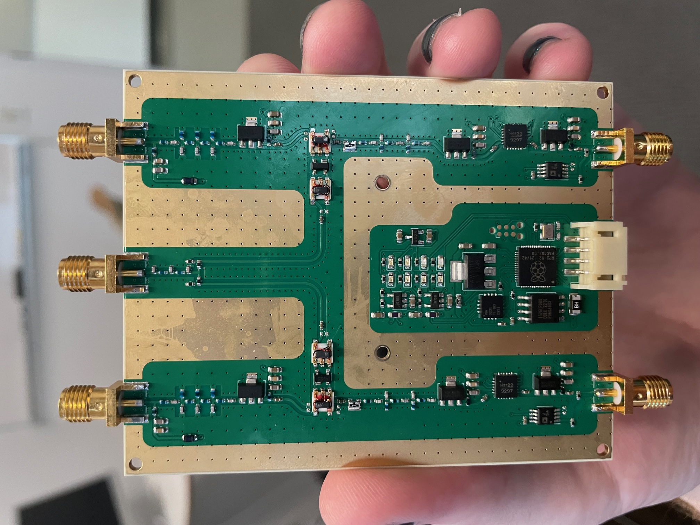

# Frontend Module

The frontend module (FEM) is a device that performs the analog signal processing
after the LNAs. This includes filtering, downconversion, and amplification.
Additionally, this module provides rudimentary monitor and control support.

|          Bare PCB          |    Completed Module    |
| :------------------------: | :--------------------: |
|  |  |

## Hardware Design

The hardware design itself is implemented in the free [KiCAD](https://www.kicad.org/)
program and is available [here](https://github.com/GReX-Telescope/FEM_Hardware).
To manufacture from gerber files, the stackup needs to be
[JLC7628](https://cart.jlcpcb.com/impedance) from JLCPCB. The current hardware
uses ENIG to help reflow of the fine-pitch components.

- Schematics
- BOM
- Case

## Firmware Design

The RF hardware mostly operates without the intervention of any software. The
only step required to use the RF hardware is to set the valid attenuation level,
which defaults to 0 dB. As such, the primary goal of the digital section of the
FEM is to perform Monitor and Control (MnC). MnC is achieved via an 115200 baud
3.3V UART interface on the main connector. The firmware design is carried out
in the Rust programming language, and whose source can be found
[here](https://github.com/GReX-Telescope/FEM_Firmware).

### Monitor

Every 1 second on UART (115200 baud), JSON payload of monitor data is sent out
with the following schema

```json
{
  "boardTemp": 29.6,
  "voltages": {
    "rawInput": 6.2,
    "analog": 4.9,
    "lnaOne": 5.3,
    "lnaTwo": 5.3
  },
  "currents": {
    "rawInput": 0.723,
    "analog": 0.53,
    "lnaOne": 0.053,
    "lnaTwo": 0.052
  },
  "ifPower": {
    "channelOne": -0.3,
    "channelTwo": -2.1
  },
  "control": {
    "calOne": false,
    "calTwo": false,
    "lnaOnePowered": true,
    "lnaTwoPowered": true,
    "attenuationLevel": 3,
    "ifPowerThreshold": -10
  }
}
```

### Control

The control payload must be a complete JSON object of the following form:

```json
{
  "control": {
    "calOne": false,
    "calTwo": false,
    "lnaOnePowered": true,
    "lnaTwoPowered": true,
    "attenuationLevel": 3,
    "ifPowerThreshold": -10
  }
}
```

Over UART, there is control for enabling/disabling the calibration output,
the LNA bias, and the interstage IF attenuator. For the digital attenuator,
there are four levels (0-3), representing 0, 4, 8, 12 dB. This attenuator
is to maximize the dynamic range of the ADC and can be set for environmental RFI levels.

### Physical Interface

There are eight LEDs on the front panel. Four red LEDs to indicate power
statess, two blue LEDs for serial activity, and two green LEDs for system
status. The green LEDs will be enabled when the IF power is at a nominal
level and will flash when the calibration signal is enabled.
