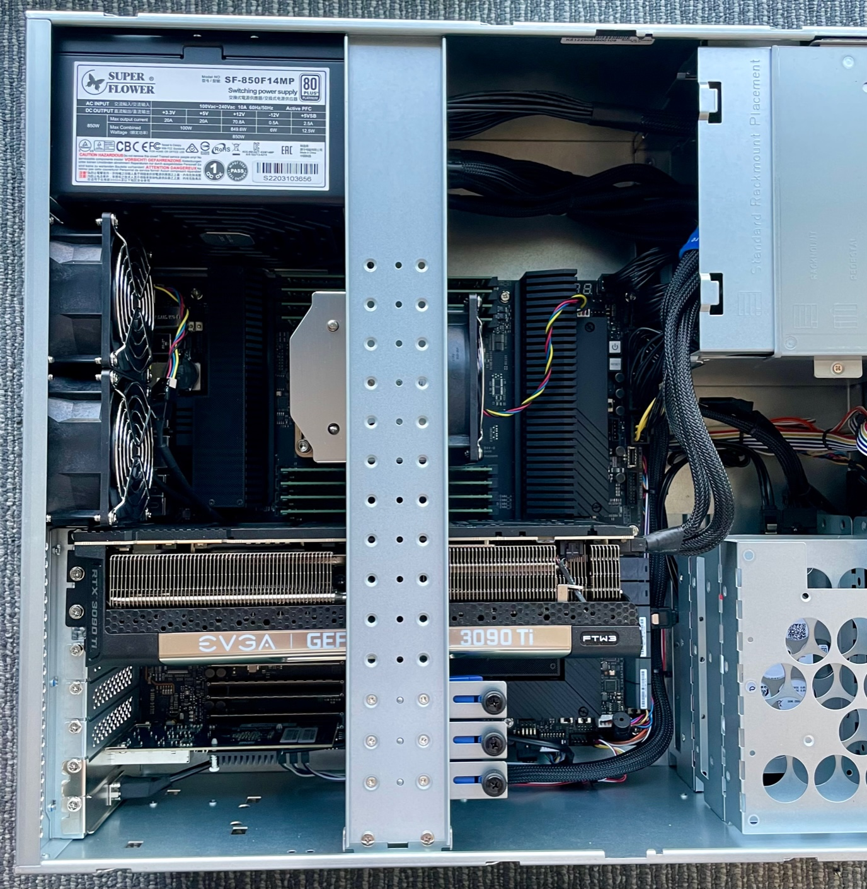

# Server Setup

Once you get your server (either from Puget systems or otherwise), we need to setup additional hardware, adjust some system settings, setup networking, and install the pipeline software.

## Hardware Setup

The server straight from Puget does not have the GPU or 10 GbE network card installed, we will do this first.

1. Open the case and remove the GPU retention bracket
2. Remove the test GPU (T1000), keep this for later in case we need an aditional video output
3. Install the 3090 Ti in the first GPU slot, this will take up three slots of space
4. Install the network card in the bottom slot
5. Wire the 3090 Ti power cable to the harness provided by Puget (they knew this was the GPU we were going to install)
6. Remove the GPU retention clips from the retention bracket that would interfere with the card. It's too tall for it anyway.
7. Replace the retention bracket and close the case.



Finally, we need to hook up a monitor to the 3090 Ti so we can setup the software

## Initial OS Setup

On boot, you will be presented with the Ubuntu graphical interface. If a password is requested, the deafult is provided in the information booklet that came with the hardware.

First, we will change the system password. Set this to something memorable.

```sh
passwd $(whoami)
```

Now, we will update the system. There shouldn't be many updates if this is a new machine.

```sh
sudo apt-get update
sudo apt-get upgrade -y
```

We will be editing a bunch of files, if you are comfy in the command line, you probably want to install some editors. Otherwise the graphical `gedit` tool will be fine.

```sh
sudo apt-get install emacs vim -y
```

We also need `clang` for compiling C-family libraries.

```sh
sudo apt-get install clang -y
```

Finally, we will set the hostname. We'll be using the `grex-<affiliation>-<location>` paradigm (just for clarity, no real reason not to).
As in, the first server that is managed by Caltech at OVRO will be `grex-caltech-ovro`.

```sh
sudo hostnamectl set-hostname <your-hostname>
```

Some updates may require a reboot. If it asks, do that now.

## Networking

Now, we need to setup the networking for the GReX system. We will operate under the assumption that the internet-facing connection will get an IP address from a DHCP server. If that is not the case, consult whoever runs your network on the appropriate setup. Regardless of the WAN connection, the 10 GbE fiber connection to the GReX terminal will be configured the same.

### Overview

The 10 GbE fiber port serves a few purposes. It is the main data transfer link between the FPGA in the field and the server, but it also carries the monitor and control for the box. This monitor and control connection includes the SNAP control connection and the Raspberry Pi. The SNAP requires an external DHCP server, which we have to provide on this port. Additionally, the 10 GbE switch in the box has its own default subnet for configuration (`192.168.88.X`). To make everything talk to each other, we need to add two IPs on this port: one in the subnet of the switch's config interface, and the other for DHCP of the various devices.

### Netplan

In `/etc/netplan` remove any files that are currently there.

Check whether you are using NetworkManager or networkd:

```
systemctl status NetworkManager
systemctl status systemd-networkd
```

If NetworkManager is running and networkd is not, disable NetworkManager and enable networkd. (Otherwise, skip this step.)

```
sudo systemctl stop NetworkManager
sudo systemctl disable NetworkManager
sudo systemctl enable systemd-networkd
```

Then, create a new file called `config.yaml` with the following contents

```yaml
network:
  version: 2
  renderer: networkd
  ethernets:
    # Two WAN interfaces. Configure this according to your network setup
    enp36s0f0:
      dhcp4: true
    enp36s0f1:
      dhcp4: true
    # 10 GbE connection over fiber to the box
    enp1s0f0:
      mtu: 9000
      addresses:
        - 192.168.0.1/24
        - 192.168.88.2/24
```

Then apply with

```sh
sudo netplan apply
```

### DHCP Server

Now, we need to setup the DHCP server on the 10 GbE port. First, we install the DHCP server software:

```sh
sudo apt-get install dnsmasq
```

Create the configuration file in `/etc/dnsmasq.conf`

```ini
# Only bind to the 10 GbE interface
interface=enp1s0f0
# Disable DNS
port=0
# DHCP Options
dhcp-range=192.168.0.0,static
dhcp-option=option:router,192.168.0.1
dhcp-option=option:netmask,255.255.255.0
#dhcp-host=<SNAP_MAC>,192.168.0.3,snap
#dhcp-host=<PI_MAC>,192.168.0.2,pi
log-async
log-queries
log-dhcp
```

Then, enable the DHCP server service

```sh
sudo systemctl enable dnsmasq --now
```

This sets up a very simple DHCP server that will give the IP address `192.168.0.3` to the SNAP and `192.168.0.2` to the Pi.
Unfortunately, the folks who set up the networking interface for the SNAP only provide a DHCP interface and a dynamic (non-observable) MAC address (for some reason). There can also be issues with setting up the Pi within the DHCP server, so it is easiest to set it up alongside the SNAP.
Turn on the SNAP and Pi, wait for them to try to get IP addresses from `dnsmasq` so we know their MACs, then update the `dhcp-host` lines for both and restart the DHCP server.

1. Configure the Pi following the instructions in [box setup](box.md)
2. Power cycle the SNAP (or turn them on if they weren't turned on yet) following the instructions in [operation](operation.md)
3. Wait a moment and open the log of dnsmasq with `journalctl -u dnsmasq`, skip to the bottom with `G` (Shift + g)
4. You should see two lines like this one but with different MAC addresses (and the Pi will say `pi` rather than `no address available`, which differentiates it from the SNAP)

```
Aug 16 14:39:06 grex-caltech-ovro dnsmasq-dhcp[5115]: 1085377743 DHCPDISCOVER(enp1s0f0) 00:40:bf:06:13:02 no address available
```

This implies the SNAP has a MAC address of `00:40:bf:06:13:02` (yours will be different). 4. Go back and uncomment and edit the `dhcp-host` lines of `/etc/dnsmasq.conf` to contain the corresponding MACs for the SNAP and Pi.
For example, in this case we would put `dhcp-host=00:40:bf:06:13:02,192.168.0.3,snap` 5. Finally, restart the dhcp server with `sudo systemctl restart dnsmasq`

After waiting a bit for the SNAP to send a new request for a DHCP lease, look at the latest logs again from journalctl. If it ends with something like

```
Aug 16 14:43:02 grex-caltech-ovro dnsmasq-dhcp[6024]: 1085377743 DHCPREQUEST(enp1s0f0) 192.168.0.3 00:40:bf:06:13:02
Aug 16 14:43:02 grex-caltech-ovro dnsmasq-dhcp[6024]: 1085377743 tags: known, enp1s0f0
Aug 16 14:43:02 grex-caltech-ovro dnsmasq-dhcp[6024]: 1085377743 DHCPACK(enp1s0f0) 192.168.0.3 00:40:bf:06:13:02 snap
Aug 16 14:43:02 grex-caltech-ovro dnsmasq-dhcp[6024]: 1085377743 requested options: 1:netmask, 3:router, 28:broadcast, 6:dns-server
Aug 16 14:43:02 grex-caltech-ovro dnsmasq-dhcp[6024]: 1085377743 next server: 192.168.0.1
Aug 16 14:43:02 grex-caltech-ovro dnsmasq-dhcp[6024]: 1085377743 sent size:  1 option: 53 message-type  5
Aug 16 14:43:02 grex-caltech-ovro dnsmasq-dhcp[6024]: 1085377743 sent size:  4 option: 54 server-identifier  192.168.0.1
Aug 16 14:43:02 grex-caltech-ovro dnsmasq-dhcp[6024]: 1085377743 sent size:  4 option: 51 lease-time  1h
Aug 16 14:43:02 grex-caltech-ovro dnsmasq-dhcp[6024]: 1085377743 sent size:  4 option: 58 T1  30m
Aug 16 14:43:02 grex-caltech-ovro dnsmasq-dhcp[6024]: 1085377743 sent size:  4 option: 59 T2  52m30s
Aug 16 14:43:02 grex-caltech-ovro dnsmasq-dhcp[6024]: 1085377743 sent size:  4 option: 28 broadcast  192.168.0.255
Aug 16 14:43:02 grex-caltech-ovro dnsmasq-dhcp[6024]: 1085377743 sent size:  4 option:  1 netmask  255.255.255.0
Aug 16 14:43:02 grex-caltech-ovro dnsmasq-dhcp[6024]: 1085377743 sent size:  4 option:  3 router  192.168.0.1
```

That means the SNAP got an IP. There should be similar lines for the Pi. You should now be able to `ping 192.168.0.3` and `ping 192.168.0.2` to make sure the SNAP and Pi are alive.

### Advanced 10 GbE Settings

Unfortunately, the OS's default configuration for the 10 GbE network card is not optimized for our use-case of streaming time domain science data. As such, we need to adjust a few things.

Create the file `/etc/sysctl.d/20-grex.conf` with the following contents:

```conf
kernel.shmmax = 68719476736
kernel.shmall = 4294967296
net.core.rmem_max = 536870912
net.core.wmem_max = 536870912
net.core.optmem_max = 16777216
vm.swappiness=1
```

Then apply these changes with

```sh
sudo sysctl --system
```

Now, we need a program called `ethtool` to apply some more settings

```sh
sudo apt-get install ethtool -y
```

Now we will create a file to run on boot to apply a sequence of ethtool settings.

Create the file `/etc/rc.local` with the following contents:

```sh
#!/bin/env bash
ethtool -G enp1s0f0 rx 4096 tx 4096
ethtool -A enp1s0f0 rx on
ethtool -A enp1s0f0 tx on
```

Make this file executable with

```sh
sudo chmod +x /etc/rc.local
```

Now create the file `/etc/systemd/system/rc-local.service` with the following contents:

```ini
[Unit]
 Description=/etc/rc.local Compatibility
 ConditionPathExists=/etc/rc.local

[Service]
 Type=forking
 ExecStart=/etc/rc.local start
 TimeoutSec=0
 StandardOutput=tty
 RemainAfterExit=yes
 SysVStartPriority=99

[Install]
 WantedBy=multi-user.target
```

Then enable the `rc-local` service

```sh
sudo systemctl enable rc-local
```

Finally, reboot

## GPU Drivers / CUDA

Heimdall (the pulse detection part of our pipeline) relies on the CUDA toolkit. Let's install that now (version 12.3)

```sh
wget https://developer.download.nvidia.com/compute/cuda/repos/ubuntu2204/x86_64/cuda-keyring_1.1-1_all.deb
sudo dpkg -i cuda-keyring_1.1-1_all.deb
sudo apt-get update
sudo apt-get -y install cuda-toolkit-12-3
```

And then install the open-source kernel drivers (Version 545) (overwriting previously installed ones)

```sh
sudo apt-get install -y nvidia-kernel-open-555
sudo apt-get install -y cuda-drivers-555
```

You may want to run the following to cleanup old dependencies/driver versions that may have been preinstalled

```sh
sudo apt-get autoremove
```

Reboot. Then run `nvidia-smi` to see if the CUDA version and Driver version came up correctly.

Finally, add the following to `~/.bashrc` to let our use use CUDA

```sh
# CUDA 12.3
export PATH=/usr/local/cuda-12.3/bin${PATH:+:${PATH}}
export LD_LIBRARY_PATH=$LD_LIBRARY_PATH:/usr/local/cuda-12.3/lib64
```

and `source ~/.bashrc` or relog.

!!! warning

    If you change CUDA versions, you'll need to update these paths!

## Pipeline Dependencies

### PSRDADA

We use [PSRDADA](https://psrdada.sourceforge.net/) to connect the packet capture and first stage processing pipeline [T0](https://github.com/GReX-Telescope/GReX-T0) to the pulse detection framework [heimdall](https://sourceforge.net/p/heimdall-astro/wiki/Home/). This is a library we need to install.

We will build a few programs, so might as well create a directory to do this in to keep our home directory organized.

```sh
mkdir src && cd src
```

Then clone PSRDADA

```sh
git clone git://git.code.sf.net/p/psrdada/code psrdada && cd psrdada
# Last tested version, bump as appropriate
git checkout 008afa7
```

Now, install some build dependencies

```sh
sudo apt-get install build-essential cmake ninja-build -y
```

Then, build PSRDADA

```sh
mkdir build && cd build
cmake -GNinja ..
ninja
sudo ninja install
```

This will install the control programs and libraries to `/usr/local/bin` and `/usr/local/lib`, respectively.

We have to add the latter to out linker path, by adding the following to `~./bashrc`

```sh
# PSRDADA
export LD_LIBRARY_PATH=$LD_LIBRARY_PATH:/usr/local/lib
```

Then, relog once agian.

### Heimdall

Similar process to build the pulse-detection software, heimdall.
First, clone our fork in our `~/src` directory:

```sh
cd ../
git clone --recurse-submodules  https://github.com/GReX-Telescope/heimdall-astro
cd heimdall-astro
```

Install some build dependencies

```sh
sudo apt-get install libboost-all-dev -y
```

Then build

```sh
mkdir build && cd build
cmake -GNinja ..
ninja
```

Run the test dedispersion program to make sure everything seemed to work

```sh
./dedisp/testdedisp
```

which should return

```
----------------------------- INPUT DATA ---------------------------------
Frequency of highest chanel (MHz)            : 1581.0000
Bandwidth (MHz)                              : 100.00
NCHANS (Channel Width [MHz])                 : 1024 (-0.097656)
Sample time (after downsampling by 1)        : 0.000250
Observation duration (s)                     : 30.000000 (119999 samples)
Data RMS ( 8 bit input data)                 : 25.000000
Input data array size                        : 468 MB

Embedding signal
----------------------------- INJECTED SIGNAL  ----------------------------
Pulse time at f0 (s)                      : 3.141590 (sample 12566)
Pulse DM (pc/cm^3)                        : 41.159000
Signal Delays : 0.000000, 0.000008, 0.000017 ... 0.009530
Rawdata Mean (includes signal)    : -0.002202
Rawdata StdDev (includes signal)  : 25.001451
Pulse S/N (per frequency channel) : 1.000000
Quantizing array
Quantized data Mean (includes signal)    : 127.497818
Quantized data StdDev (includes signal)  : 25.003092

Init GPU
Create plan
Gen DM list
----------------------------- DM COMPUTATIONS  ----------------------------
Computing 32 DMs from 2.000000 to 102.661667 pc/cm^3
Max DM delay is 95 samples (0 seconds)
Computing 119904 out of 119999 total samples (99.92% efficiency)
Output data array size : 14 MB

Compute on GPU
Dedispersion took 0.02 seconds
Output RMS                               : 0.376464
Output StdDev                            : 0.002307
DM trial 11 (37.681 pc/cm^3), Samp 12566 (3.141500 s): 0.390678 (6.16 sigma)
DM trial 11 (37.681 pc/cm^3), Samp 12567 (3.141750 s): 0.398160 (9.41 sigma)
DM trial 11 (37.681 pc/cm^3), Samp 12568 (3.142000 s): 0.393198 (7.25 sigma)
DM trial 11 (37.681 pc/cm^3), Samp 12569 (3.142250 s): 0.391713 (6.61 sigma)
DM trial 12 (40.926 pc/cm^3), Samp 12566 (3.141500 s): 0.441719 (28.29 sigma)
DM trial 13 (44.171 pc/cm^3), Samp 12564 (3.141000 s): 0.400574 (10.45 sigma)
DM trial 13 (44.171 pc/cm^3), Samp 12565 (3.141250 s): 0.403097 (11.55 sigma)
Dedispersion successful.
```

Finally, install this into our path with

```sh
sudo ninja install
```

The `heimdall` executable should now be available for the pipeline as well as offline analysis.

### HDF5/NetCDF

We use the fantastic [netcdf](https://www.unidata.ucar.edu/software/netcdf/) library to write out voltage
data. To do this, we need to statically link netcdf (and it's dependent HDF5) at compile time. As such, we
have to install these libraries systemw-wide.

```sh
sudo apt-get install libhdf5-dev libnetcdf-dev -y
```

## Rust

Many parts of the pipeline software are written in the Rust programming language.
We will be building this software from scratch, so we need to install the rust compiler and its tooling.
This is easy enough with [rustup](https://rustup.rs/)

We need curl for the rustup installer, so

```sh
sudo apt-get install curl -y
```

Then run the installer, using all the default settings

```sh
curl --proto '=https' --tlsv1.2 -sSf https://sh.rustup.rs | sh
```

## Python

To get out of version hell for python stuff, we're using [Poetry](https://python-poetry.org/). To install it, we will:

```sh
curl -sSL https://install.python-poetry.org | python3 -
```

We need to make a few adjustments to `~/.bashrc` to correct the paths and fix a bug. Append the following to the end.

```sh
export PATH="/home/user/.local/bin:$PATH"
# Fix the "Poetry: Failed to unlock the collection" issue
export PYTHON_KEYRING_BACKEND=keyring.backends.null.Keyring
```

Go ahead and `source ~/.bashrc` now to get these changes in your shell.

## Pipeline Software

To organize all the software needed for running the whole pipeline, we will grab the metapackage from github and clone somewhere (like the home directory):

```sh
cd
git clone --recurse-submodules https://github.com/GReX-Telescope/grex
```

Then, assuming you followed all the previous steps, build the pipeline software with

```sh
cd /grex
./build.sh
```

Next, you need to setup a `.env` file with preset variables for the pipeline to access at startup.
```sh
cd /pipeline
./grex.sh env
```

Edit the `mac=` line of `.env` to include the NIC MAC address (here the address is `80:61:5f:0a:4c:d4`, yours will be different).

```ini
mac="80:61:5f:0a:4c:d4"
```

To get you NIC MAC address, run `ifconfig` and find this section of output starting with the ethernet connection to the box (`enp1s0f0`). The address after `ether` is the NIC address.

```sh
enp1s0f0: flags=4163<UP,BROADCAST,RUNNING,MULTICAST>  mtu 9000
        inet 192.168.0.1  netmask 255.255.255.0  broadcast 192.168.0.255
        inet6 fe80::8261:5fff:fe0a:4cd4  prefixlen 64  scopeid 0x20<link>
        ether 80:61:5f:0a:4c:d4  txqueuelen 1000  (Ethernet)
        RX packets 31312797155  bytes 258061589774450 (258.0 TB)
        RX errors 10  dropped 10  overruns 0  frame 10
        TX packets 2158805  bytes 123243792 (123.2 MB)
        TX errors 0  dropped 0 overruns 0  carrier 0  collisions 0
```

Next, make the directories where all the data will be stored and change ownership to `user` (or whatever username you use)
```sh
cd /hdd
mkdir data
sudo chown user data
mkdir data/voltages
mkdir data/filterbanks
mkdir -p data/candidates/T2
mkdir -p data/candidates/T3/candfils
mkdir -p data/candidates/T3/candplots
```

Lastly, you'll need to install the `parallel` package

```sh
sudo apt install parallel -y
```

Now you can run the pipeline
```sh
cd ~/grex/pipeline
./grex.sh full
```

## Pipeline Injection and Coincidencing

NOTE: The injection and coincidencing software (T3) is currently written to operate as services that run in the background. We are changing this to make it a proper section of the pipeline that will be installed fully with the rest of the pipeline.

## Databases and Metrics Collection

### Grafana

We use Grafana as the observability frontend.
Here, we'll assume you are going to set up a Grafana cloud (free-tier) account.
While it is possible to use a self-hosted version, we found this to be the most simple.

Steps:
1. Create a grafana account [here](https://grafana.com/auth/sign-up/create-user?pg=hp&plcmt=cloud-promo&cta=create-free-account)
2. Pick a stack URL that makes sense

3. Click "Hosted Telemetry Data"

4. Click "Hosted Prometheus metrics"

5. With the default settings of "via Grafana Alloy", scroll down to generate an API token (use any name).
6. Record the `url`, `username`, and `password` of the generated Alloy configuration

7. Click the grafana logo in the top left corner and then hit "Get started" again.
8. This time, follow "Hosted Telemetry Data" with "OpenTelemetry (OTLP)"
9. Again, create an API token, scroll down to the generated Alloy configuration file and find the two sections for "grafana_cloud"
10. Record the `client.endpoint` and `username` and `password`

11. Again, return to the home screen with the grafana logo, open the menu and navigate to "Dashboards"
12. In the top right, go to "New" and then "Import"

13. Go to our observability stack and either download or copy the dashboard JSON from [here](https://github.com/GReX-Telescope/grex_observability/blob/main/t0_dashboard.json)
14. Either load or copy the model and hit "Load" and then finish the import. This is our main pipeline visualization.

15. Go back to dashboards, import again, but this type supply `1860` for the dashboard ID. This is the "Node Exporter" dashboard that will let you monitor all the metrics about your server such as disk usage, network activity, etc.
16. Select our previously setup prometheus data source

17. Now, continue to the docker setup below:

### Docker

Following [docker's documentation](https://docs.docker.com/engine/install/ubuntu/), install docker the usual way as that is what orchestrates the databases, log aggregation, and communication to grafana.

Set docker to run as a systemd service with

```sh
sudo systemctl enable docker
```

if you didn't already in the installation.

### Observability Stack

Somewhere obvious (like the home dir), clone [the stack](https://github.com/GReX-Telescope/grex_observability) and `cd grex_observability`.

The file `compose.yml` (in conjunction with `config.alloy`) tells Docker how to build the containers and set up the Prometheus and OpenTelemetry services. By default, `compose.yml` will utilize a predefined image of Prometheus to store data at `/var/lib/docker/volumes/` for 15 days. We want to have access to much longer time streams than this, meaning we need to change the location to somewhere on disk with greater available space and change the retention to some longer duration, say 2 years. Change the Prometheus section of `compose.yml` to the following (or to alternative disk location and retention time):
```ini
prometheus:
    image: prom/prometheus:latest
    container_name: prometheus
    command:
      - "--config.file=/etc/prometheus/prometheus.yml"
      - "--enable-feature=remote-write-receiver"
      - "--storage.tsdb.retention.time=2y"
      - "--storage.tsdb.path=/prometheus"
    ports:
      - 9090:9090
    restart: always
    volumes:
      - /hdd/prometheus:/prometheus
```
Check the UID and GID of the Prometheus image (most likely 65534:65534, equivalent to nobody:nogroup).
```sf
docker run --rm prom/prometheus sh -c 'id'
```

Now make `/hdd/prometheus` and give the service ownership so it can write to it.
```sf
mkdir /hdd/prometheus
sudo chown -R 65534:65534 /hdd/prometheus
```

Copy `alloy.env.example` to `alloy.env` and fill out the sections according to your grafana configuration.

- `GRAFANA_OTLP_ENDPOINT` is `client.endpoint` from the OpenTelemetry config
- `GRAFANA_OTLP_USER` is `username` from the OpenTelemetry config
- `GRAFANA_OTLP_PASSWORD` is `username` from the OpenTelemetry config
- `GRAFANA_PROM_ENDPOINT` is `url` from the Prometheus config
- `GRAFANA_PROM_USER` is the `username` from the Promethus config
- `GRAFANA_PROM_PASS` is the `password` from the Prometheus config

Following the Grafana example above, a completed `alloy.env` file will look like this


Test the stack with

```sh
sudo docker compose up
```

Navigate to your Grafana `Node Exporter Full` dashboard (it may take a reselect of `Datasource` to populate) but you should now see the dashboard with all its data.

`Ctrl-C` out of that and then start up the stack in the background with

```sh
sudo docker compose up -d
```

## Pi SSH

The last thing will be to configure easy access to the Raspberry Pi's SSH. We can do that by creating a passwordless SSH key and installing it on the pi. We're going to be behind ssh anyway, and the Pi isn't public-facing, so this is a safe thing to do.

On the server, generate a new ssh keypair with

```sh
ssh-keygen -t rsa
```

Then, install it on the pi with

```sh
ssh-copy-id pi@192.168.0.2
```

Finally, create an SSH config that automatically supplies the hostname and user:

Create a file on the GReX server in `~/.ssh/config` with the contents

```
Host pi
    Hostname 192.168.0.2
    User pi
```

Now you can test the easy connection with

```sh
ssh pi
```

All done! We should now be ready to run the pipeline!
