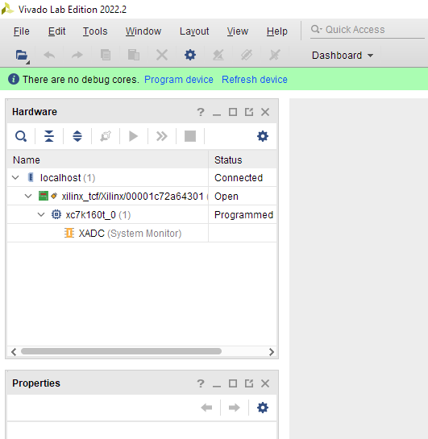
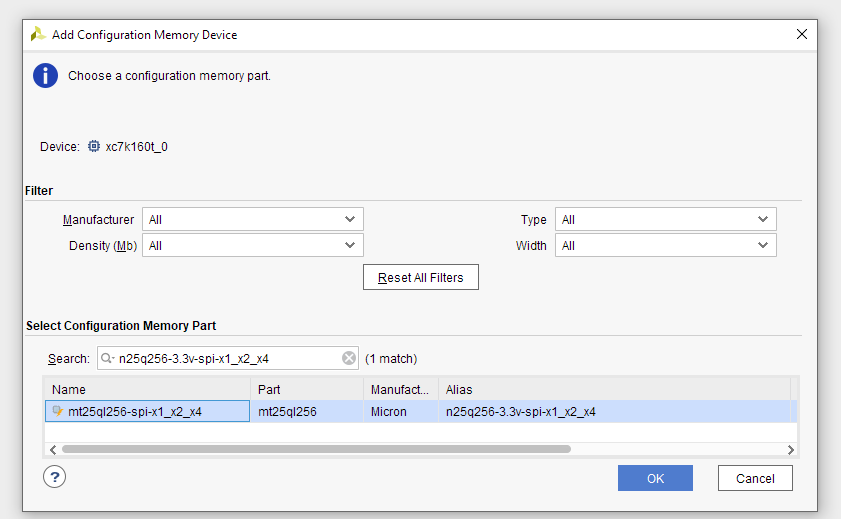
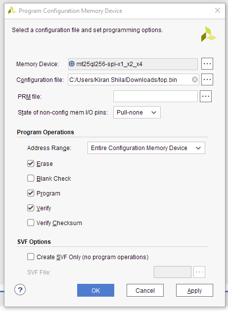

# SNAP Configuration and Bringup

The digital backend to the GReX system is a
[SNAP](https://casper.astro.berkeley.edu/wiki/SNAP) board from the CASPER group
at Berkeley. This board contains the analog to digital converters and Xilinx
FPGA to perform the digitization and F-engine components of the system.

The setup and configuration of this board has seemingly never been well
documented, so we'll try to make it as painless as possible here.

The FPGA Simulink model is stored
[here](https://github.com/GReX-Telescope/gateware) with the latest releases
found [here](https://github.com/GReX-Telescope/gateware/releases). Grab the
latest fpg file, and you're good to go - no reason to recompile it.

## SNAP Golden Image

To document the steps that are performed before shipping a box, here are the steps to program the golden (bootstrapping) image:

Set switch S1 on the SANP so that switches 2 and 5 are set to on.
(In the on position, the switches are moved towards the edge of the PCB).
The other switches on S1 should be off.
This allows the SNAP to boot from the nonvolatile flash memory.

To flash this storage device, you need the free Vivado Lab Edition (VLE) and the expensive Xilinx Platform Cable.

After launching VLE, click `Open hardware manager`. After this, a green bar at the top should ask you to autoconnect. Assuming the platform cable is plugged into the SNAP and everything is powered on, click on that. It should connect and show the `xc7k160t` FPGA in the hardware section on the left.

In VLE, under `tools` go to `Add configuration memory device`.
Use the memory device `n25q256-3.3v-spi-x1_x2_x4`.

It will then ask if you want to program the memory now, hit `Ok`.

Using the golden image for the configuration file [here](../assets/golden.bin), program the entire configuration memory device.

Unplug programmer before rebooting.
All done! A reboot should start blinking some LEDs and the ethernet should get a DHCP address (if it's plugged in).

## TAPCP and the Raspberry Pi

The gateware we've built for the SNAP board includes a small CPU called the MicroBlaze
that hosts a small webserver to deal with runtime interactions with FPGA memory. This server
gets an IP address from a DHCP server running on the main capture computer. This interface can also
be used to reprogram the SNAP if the gateware changes. By deafult, we'll ship SNAP boards that
have the GReX gateware preprogramed, but it's always possible to reprogram it.

This interface is over the UDP protocol TFTP, where the folks at CASPER have wrapped reading and
writing files as the interaction to both the flash and FPU memory. We've written a wrapper to the
so called "TAPCP" protocol [here](https://github.com/kiranshila/tapcp_rs). It is with this library
that the packet capture code informs the SNAP when to activate timing signals.

## FPGA Clocks, References, PPS, Synthesizers

The FPGA needs an external clock source, which is being provided via one of the
outputs of the Valon synthesizer in the box. Additionally, the board needs "pulse per
second" (PPS) ticks, which come from the GPS reciever.

The Valon synthesizer has two outputs but can lock both to an external reference.
The GPS receiver in the box provides this (10 MHz) alongside the PPS signal.